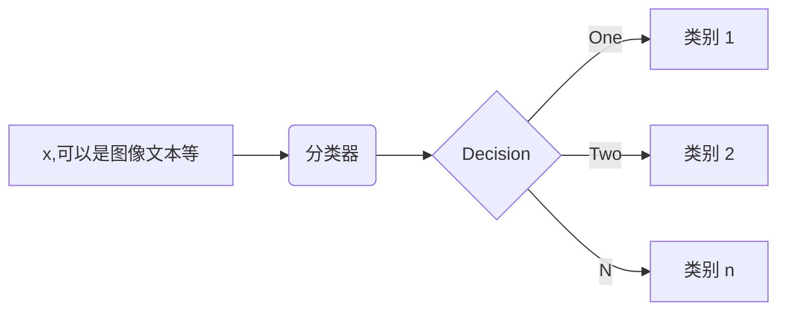
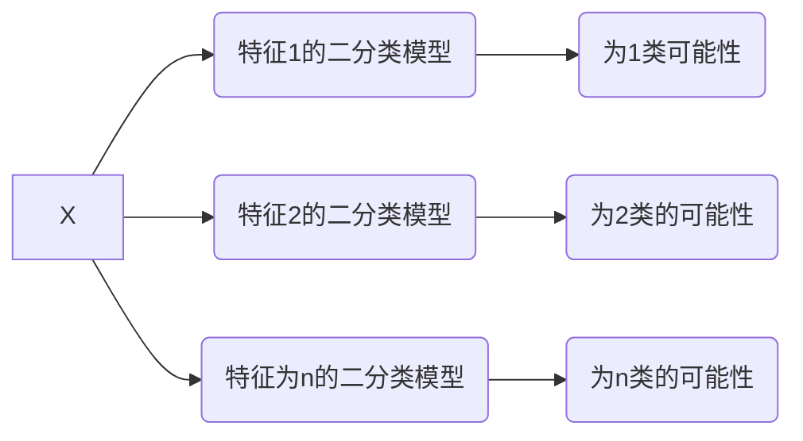

# 逻辑回归 Logistic regression
线性回归是逻辑回归的基础，逻辑回归是深度学习（神经网络）的基础

## 基本知识
逻辑回归主要用于分类：



线性回归：知道坐标的一部分预测另一个
逻辑回归：知道完整的坐标，预测和直线的相对位置

设$w_{1}x_{1}+w_{2}x_{2}+w_0=d$,$f$为分类的类别：**那么对于一个二分类问题**，$d>0$时$f=1$,$d<0$时$f=0$,这样的分类曲线太硬了，非1即0没有更多的信息——>平滑

平滑函数：

$$f= \frac{1}{1+e^{-d} }$$
$$\frac{\partial f}{\partial d}=f(1-f)$$ 
在$d$很大和很小时变化都很缓慢，在$d=0$时变化最快。

$mse=\sum_{i=1}^{n} (f_{1}-y{i})^{2}$
即找$w$使得$mse$最小————这样对吗？这里的mse依然可以这样计算吗？**不能！** 上面求的是欧氏距离。需要找一种新的预测值和真实值距离来度量。

预测出来的结果是概率，比如发生0.9，不发生0.1
真实情况是发生1，不发生0
衡量概率的距离我们用**KL距离**：
$$KL(p,q)=\sum_{i=1}^{n}p(x_{i}).log\frac{p(x_{i})}{q_(x_{i})} $$ 
($n$表示分类情况的个数)不具备对称性
，连续的情况用$\int$）

**要想使KL距离较小，$p(x_{i})$较大时$q({x_{i})}$越小越好，当$p(x_{i})$较小时$q$无所谓**，注意关注点是$p(x_{i})$项,$q(x_{i})$要首先拟合$p(x_{i})$的较大处。

反之对于$KL(q,p)=\sum_{i=1}^{n}q(x_{i}).log\frac{q(x_{i})}{p_(x_{i})}$要首先拟合$q(x_{i})$的较小处。

**$KL$距离不对称。** 一个拟合较大处一个拟合较小处，都会有信息损失。
所以用交叉熵来定义损失函数：
$$\sum_{i=1}^{n}\left [ y_{i}\cdot log\frac{y_{i}}{f_{i}} +(1-y_{i})\cdot log\frac{(1-y_{i})}{(1-f_{i})} \right ]$$
简化最终损失函数为：
$$KL =-\frac{1}{n} \sum_{i=1}^{n} \left [ y_{i}\cdot logf_{i}+(1-y_{i})\cdot log(1-f_{i}) \right ] $$
其中$f$由平滑函数 $f= \frac{1}{1+e^{-d} }$得出

**回归流程**，先随机给出1个$W$计算模型输出，计算模型输出和真实数值的差异，得到损失函数（$mse$,$KL$距离），不停调整$W$让损失函数变小。

```python
model = LogisticRegression()
model.fit(X_train,y_train)
loss = log_loss(y_test,y_pred)
```
调整$W$的过程即梯度下降的过程，求导我们可以得出一个高度对称的函数：
$$\frac{\partial KL}{\partial w} =\sum_{i=1}^{n} \frac{-1}{n} [y_{i}(1-f_{i})-(1-y_{i})f_{i}]x$$
梯度下降:
$$w=w-\alpha \frac{\partial KL}{\partial w} $$

**所以为什么不能用mse呢？**
$$mse =\frac{1}{n} \sum_{1}^{n} (f_{i}-y_{i} )^{2} $$
$$\frac{\partial mse}{\partial w} = \frac{2}{n} \sum_{n}^{i=1} (f_{i}-y_{i})f_{i}(1-f_{i})x$$
最开始$w$是随机的，如果开始$w$是一个很大的正值，那么$f_{i}$趋向于1，否则趋向于0

所以上面的偏导数很小

所以$w$几乎没有变化，学习不到东西，同时容易达到局部极小值

**但是如果多选几个初始点呢？** 在机器学习的前沿领域，很多研究都是在研究怎么选择初始点，但是在工程上达不到很好的效果。选对初始点是很难的：工程上$X$的维度很大，而**局部极小值的维度和$X$维度的平放成正比**。


## 多分类问题的处理
对$X$进行多分类,$n$个分类最终得出$n+1$种分类结果

在业务上为了随时修改类别的设置，一般用$n$个二分类模型进行处理


最终取可能性最大的类别作为A属于的类别，如果可能性都很小（比如说小于一个阈值）则不予考虑

这样的模型构造灵活，方便改造

## 线性不可分
举个最简单的例子，假设二维平面$x,y$上存在若干点，其中点集$A$服从${x,y|x^2+y^2=1}$，点集B服从
$\left \{ x,y|x^2+y^2=9\right \}$，那么这些点在二维平面上的分布是


蓝色的是点集A，红色的是点集B，他们在xy平面上并不能线性可分，即用一条直线分割（虽然肉眼是可以识别的）

采用映射$(x,y)->(x,y,x^2+y^2)$后，在三维空间的点的分布为：

可见红色和蓝色的点被映射到了不同的平面，在更高维空间中是线性可分的（用一个平面去分割）。
(和上一节线性回归中的维度扩充方法类似)

同时思考为什么（一）中对年龄等进行了分段-->逻辑回归时候系数矩阵计算快，$f$计算快

数据的不平衡会导致逻辑回归出现问题9999：1

解决问题：
下采样：1:1
上采样（数据的重复出现）：9999:9999

