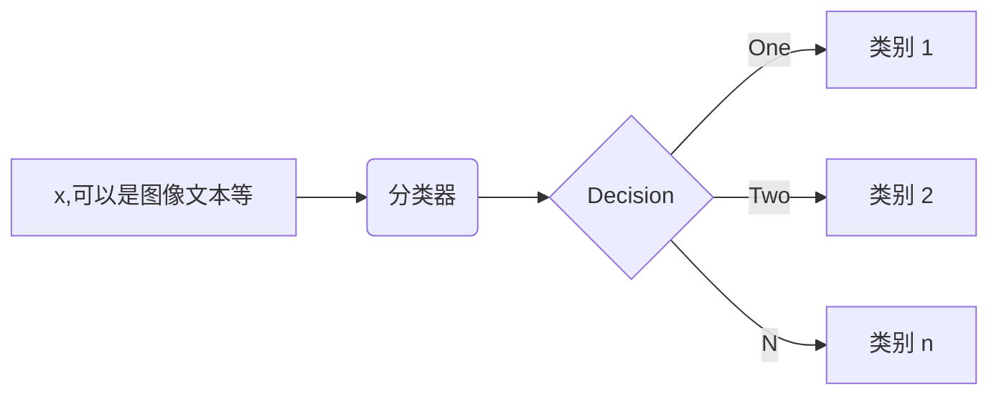

# 逻辑回归
线性回归是逻辑回归的基础，逻辑回归是深度学习（神经网络）的基础

逻辑回归主要用于分类：

线性回归：知道坐标的一部分预测另一个
逻辑回归：知道完整的坐标，预测和直线的相对位置

设$w_{1}x_{1}+w_{2}x_{2}+w_0=d$,$f$为分类的类别：那么对于一个二分类问题，$d>0$时$f=1$,$d<0$时$f=0$,这样的分类曲线太硬了，非1即0没有更多的信息——>平滑

平滑函数：

$$f= \frac{1}{1+e^{-d} }$$
$$\frac{\partial f}{\partial d}=f(1-f)$$ 
在$d$很大和很小时变化都很缓慢，在$d=0$时变化最快。

$mse=\sum_{i=1}^{n} (f_{1}-y{i})^{2}$
即找$w$使得$mse$最小————这样对吗？这里的mse依然可以这样计算吗？**不能！** 上面求的是欧氏距离。需要找一种新的预测值和真实值距离来度量。

预测出来的结果是概率，比如发生0.9，不发生0.1
真实情况是发生1，不发生0
衡量概率的距离我们用**KL距离**：
$$KL距离=\sum_{i=1}^{n}p(x_{i}).log\frac{p(x_{i})}{q_(x_{i})} $$ 
($n$表示分类情况的个数)不具备对称性
，连续的情况用$\int$

**要想使KL距离较小，$p(x_{i})$较大时$q({x_{i})}$越小越好，当$p(x_{i})$较小时$q$无所谓**
